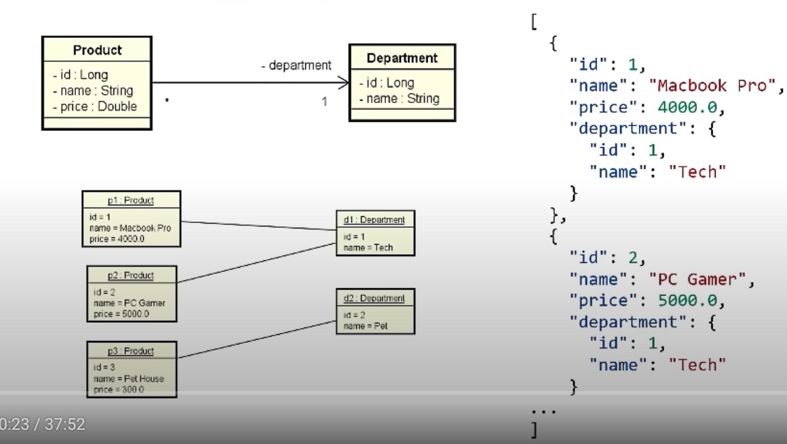
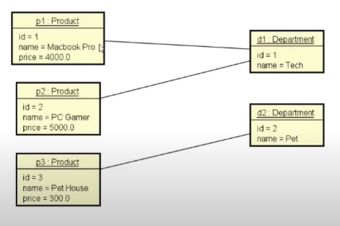

# Projeto de uma API com SpringBoot.

### O Spring é um framework que ajuda bastante no desenvolvimento de aplicações Java mais complexas. Ele oferece diversas funcionalidades apenas para o desenvolvedor usufruir de forma rápida e descomplicada. Entre seus vários recursos, ele possui um web server (Tomcat), Serialização JSON, Mapeamento de URL e Multi-threading.

 

## Arquitetura

 

## Diagrama de Classes com representação em JSON

 

## Diagrama de Objetos

 

## Endpoints

* Retorna todas os produtos:

    > http://localhost:8080/products